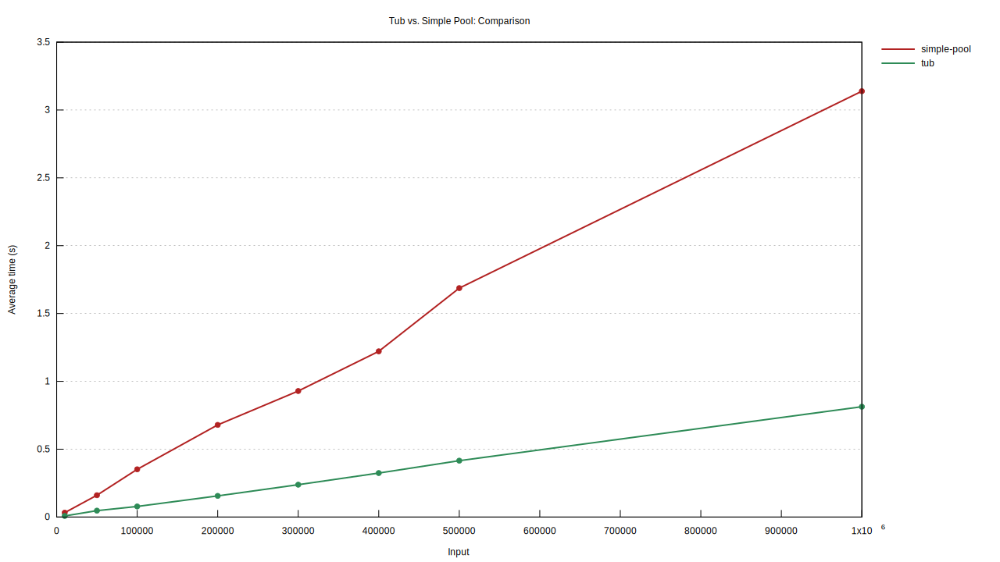
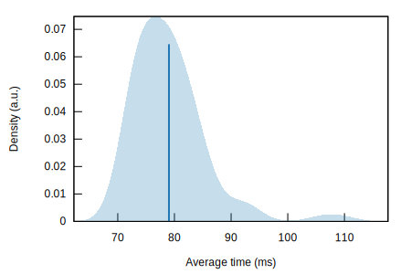
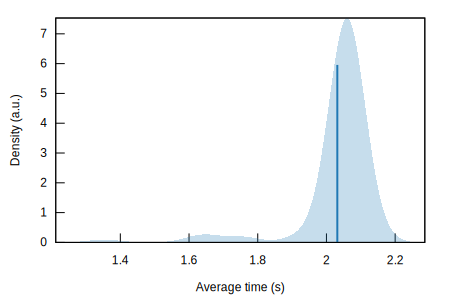
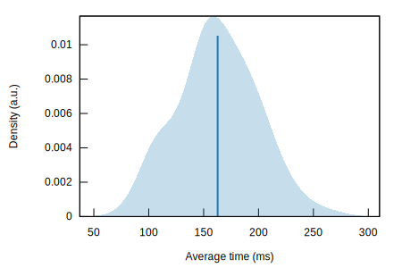

# Tub 🛁

[](https://github.com/wcygan/tub)
[](https://crates.io/crates/tub)
[](https://docs.rs/tub)
[](https://github.com/wcygan/tub/actions?query=branch%3Amaster)
[](https://codecov.io/gh/wcygan/tub)


A *blazingly fast* object pool for Rust.

Values are retrieved from the pool asynchronously. When the retrieved value goes out of scope, the value is returned to the pool.

## Documentation

Read about the public API: [docs.rs/tub](https://docs.rs/tub)

Read about the design: [wcygan.io/post/pools](https://www.wcygan.io/post/pools/)

## Usage

To use Tub, add this to your Cargo.toml:

```toml
[dependencies]
tub = "0.3.6"
```

Then create and use a pool like so:

```rust
use tub::Pool;

#[tokio::main]
async fn main() {
   // Create a pool
   let pool: Pool<Box> = (0..10)
       .map(|_| Box { value: 123 })
       .into();

   // Get a value from the pool
   let mut box1 = pool.acquire().await;

   // Use the value
   box1.foo();

   // Modify the value
   *box1 = Box { value: 456 };

   // Return the value to the pool
   drop(box1);
}

struct Box {
  value: u32
}

impl Box {
  fn foo(&mut self) { }
}
```

## Benchmarks

In the ["Pools"](https://www.wcygan.io/post/pools/#results) blog post I benchmarked Tub against other object pools in Rust.

The benchmarks help us understand how efficient the underlying mechanisms for concurrency control, object storage, and object reuse are.

The results are as follows:

### Input-based comparison

The following benchmarks compare the performance of different pools under different amounts of load:




### 100,000 acquires & releases

The following benchmarks compare the performance of running 100,000 acquire & release operations across tasks.

### [Tub](https://crates.io/crates/tub)



### [Async Object Pool](https://crates.io/crates/async-object-pool)



### [Simple Pool](https://crates.io/crates/simple-pool)

